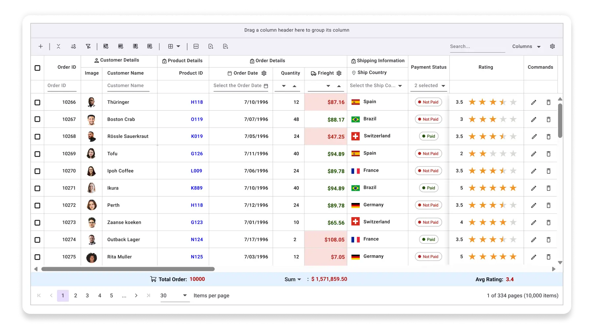
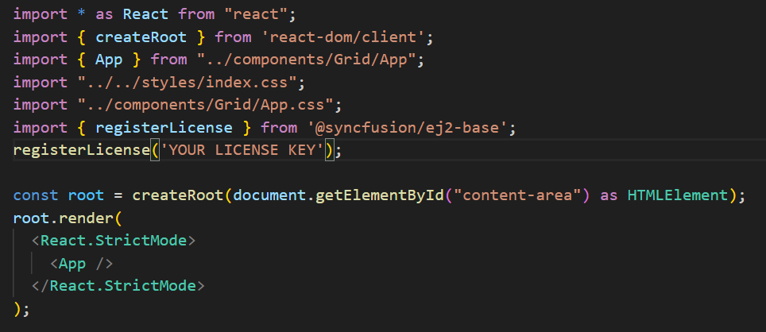

# React-feature-rich-datagrid

This sample demonstrates the full capabilities of the Syncfusion [React Data Grid](https://www.syncfusion.com/react-components/react-data-grid) by integrating all available APIs into a single, interactive experience. Users can dynamically enable or disable features such as CRUD operations, editing, and exporting—directly through the UI—without writing a single line of code. This makes it an ideal tool for presales evaluations, customer demos, and internal testing, allowing users to explore and understand the grid's flexibility and power in real time.

 

## Project prerequisites
Make sure that you have the compatible versions of [Visual Studio Code](https://code.visualstudio.com/download ) and [NodeJS](https://nodejs.org/en/download) or later version in your machine before starting to work on this project.

## How to run this application?

1. Clone the React-Feature-Rich-Grid repository.
2. Run the `npm install` command to install the required packages
3. Replace YOUR_LICENSE_KEY in registerLicense method of the index.tsx file with your license key.

 

4. Run your project using the `npm start` command.

## Further help
For more help, check the [Syncfusion React Data Grid example](https://ej2.syncfusion.com/react/demos/#/tailwind3/grid/overview),
 [Syncfusion React Data Grid documentation](https://ej2.syncfusion.com/react/documentation/grid/getting-started).